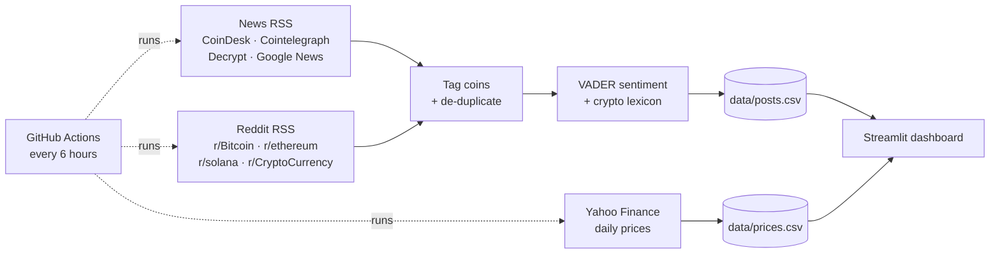

# Crypto Sentiment Dashboard (v2)

> **Version 2** is a redesign of [crypto-dashboard](https://github.com/Z3US-23/crypto-dashboard) with a trading-terminal interface: daily candlesticks, a sentiment gauge and sparklines. The original v1 is also [live](https://crypto-sentiment-dashboard-5vcjnk8vieydnlappdhzayy.streamlit.app/).

**🔗 Live dashboard: [crypto-dashboard-v2.streamlit.app](https://crypto-dashboard-v2-2nnqcnwrymsvysim2kh8oq.streamlit.app/)**

**What are crypto news and Reddit saying about Bitcoin, Ethereum and Solana, and does the mood line up with the price?**

An automated data pipeline that collects crypto headlines and Reddit posts every 6 hours, scores their sentiment with NLP, and compares it with market prices in an interactive dashboard.


---

## Highlights

- **Automated data pipeline.** A scheduled GitHub Actions job collects fresh data every 6 hours and commits it to this repo, so the dataset grows on its own. No server or paid API needed.
- **11 data sources, zero API keys.** CoinDesk, Cointelegraph, Decrypt and Google News RSS feeds, four subreddits via Reddit's public RSS, and daily prices from Yahoo Finance.
- **NLP sentiment scoring.** VADER sentiment analysis extended with a custom crypto lexicon (*bullish*, *rekt*, *FUD*, *liquidated*, ...) that the default model doesn't understand.
- **Interactive dashboard.** Built with Streamlit and Plotly, styled like a trading terminal: daily price candles with each day's mood underneath, a sentiment gauge, per-coin cards with sparklines, and the headlines driving the mood. Filter by coin, period and source.
- **Honest statistics.** Days with too few items are faded or excluded, and the sentiment-vs-price correlation only appears once there are enough days of data. It comes with a clear "correlation is not causation" caveat.
- **Production-minded collection.** Handles rate limits (it reads Reddit's `x-ratelimit-reset` header and waits), de-duplicates the same story syndicated across outlets, and keeps running if one source fails.

## How it works



1. **Collect.** `src/collect_news.py` and `src/collect_reddit.py` pull the latest headlines and posts; `src/collect_prices.py` pulls 180 days of daily open, high, low and close prices.
2. **Tag.** Items from general sources are assigned to a coin when they mention it by name or ticker (word-boundary regex, so "Solana" matches but "console" doesn't).
3. **Score.** Each headline plus the first 500 characters of its summary or post body gets a VADER compound score from −1 to +1. Scores ≥ 0.05 are positive and ≤ −0.05 negative.
4. **Store.** New rows are merged into `data/posts.csv`, de-duplicated by headline, so the same story from two outlets counts once.
5. **Visualise.** `app.py` aggregates by day and lines sentiment up against price and next-day returns.

## Tech stack

| Area | Tools |
|---|---|
| Language | Python 3.12 |
| Data collection | `requests`, `feedparser`, `yfinance` |
| Data processing | `pandas` |
| NLP | `vaderSentiment` with a custom crypto lexicon |
| Visualisation | `streamlit`, `plotly` |
| Automation | GitHub Actions (cron schedule) |

## Run it locally

```bash
git clone https://github.com/Z3US-23/crypto-dashboard-v2.git
cd crypto-dashboard-v2
python -m venv .venv
.venv\Scripts\activate          # Windows  (macOS/Linux: source .venv/bin/activate)
pip install -r requirements.txt

python -m src.pipeline          # collect fresh data (~3-5 min, Reddit rate-limits)
streamlit run app.py            # open http://localhost:8501
```

## Project structure

```
crypto-dashboard-v2/
├── app.py                     # Streamlit dashboard
├── assets/theme.css           # dashboard styling (dark trading-terminal look)
├── .streamlit/config.toml     # Streamlit theme: colours and font
├── src/
│   ├── config.py              # coins, keywords, feeds, file paths
│   ├── collect_news.py        # news RSS + Google News
│   ├── collect_reddit.py      # Reddit RSS with rate-limit handling
│   ├── collect_prices.py      # Yahoo Finance daily OHLC prices
│   ├── sentiment.py           # VADER + crypto lexicon
│   ├── text_utils.py          # HTML cleaning, coin tagging, de-dup ids
│   └── pipeline.py            # one full collection run
├── data/                      # growing dataset (updated by GitHub Actions)
│   ├── posts.csv
│   ├── prices.csv
│   └── meta.json              # last run time + per-source status
└── .github/workflows/collect.yml
```

## Limitations

- **VADER is word-based.** It's fast and transparent but misses sarcasm and context. For example, "Hodl Hodl" (an exchange name) reads as positive. A transformer model such as FinBERT would be more accurate but much heavier to run every 6 hours.
- **Mention counts reflect the feeds, not the whole market.** Google News returns at most 100 results per query, and RSS feeds only show recent items.
- **Short history.** The dataset started in October 2026 and grows every 6 hours. The correlation test unlocks after 10 days with enough data, and it is exploratory, not a trading signal.

## Next steps

- Compare VADER against FinBERT on a hand-labelled sample of headlines.
- Add hourly prices to test whether sentiment shifts lead price moves within the same day.
- Add more coins and track which outlets are consistently more bullish or bearish.

---

Built by **Ahmad Ammar**, BS Economics with a minor in Data Analytics, Forman Christian College.
